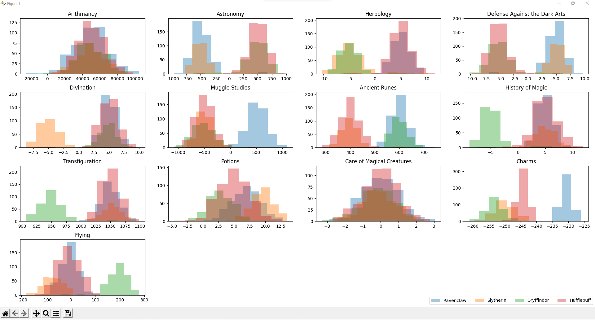
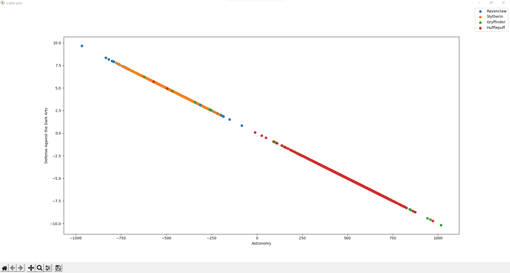
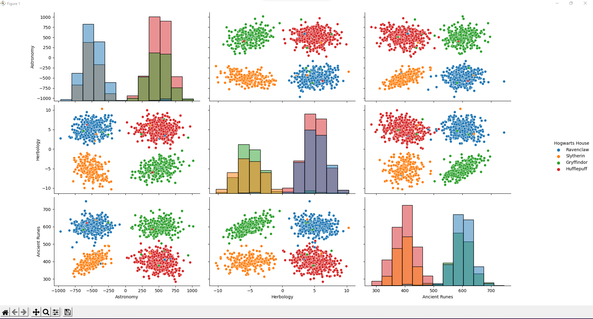

# DSLR
DataScience x Logistic Regression - School 42 project

## Goals
* Learn how to read a dataset, to visualize it in different ways, to select and clean unnecessary information from your data.
* Implement one-vs-all logistic regression that will solve classification problem

Look at subject.pdf for more information

## Requirements
* `Python 3`
* `NumPy`
* `Pandas`
* `Matplotlib`
* `seaborn`
* `sklearn`

## Setup

```
git clone https://github.com/Gleonett/DSLR.git
cd DSLR
pip3 install -r requirements.txt
```

##Overview

|[histogram.py](histogram.py)|[scatter_plot.py](scatter_plot.py)    | [pair_plot.py](pair_plot.py)                  |
|---------------------------------------------|-------------------------------------------------------|-----------------------------------------------|
|    |        |  |
| Show course marks distribution              |Show values for two courses using Cartesian coordinates| Pair plot                                     |

Accuracy with standard parameters is `0.99`


* [log_reg_train.py](logreg_train.py) saves `train.mlmodel`
* [log_reg_predict.py](logreg_predict.py) takes `train.mlmodel` and saves `houses.csv`

## Commands

### Example

```
python3 .\log_reg_train.py .\dataset\dataset_train.csv
python3 .\log_reg_predict.py .\dataset\dataset_test.csv
python3 .\log_reg_train.py .\dataset\dataset_train.csv -a 0.9
```
### Display Usage
```
python3 .\log_reg_train.py
python3 .\log_reg_train.py
python3 .\histogram.py
python3 .\pair_plot.py
python3 .\scatter_plot.py
python3 .\describe.py
```
